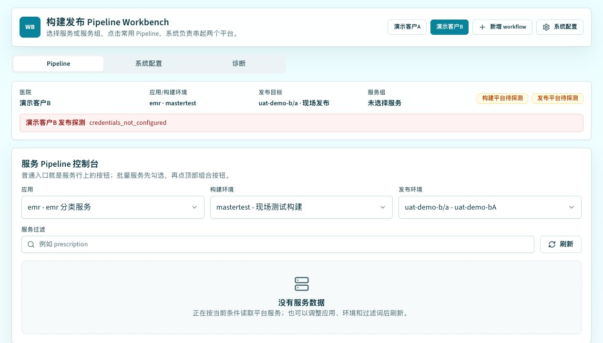

# Build & Release Workbench

Build & Release Workbench 是一个本地运行的 MVP：把“构建平台 + 发布平台”聚合成服务优先的二合一构建发布控制台。用户选择 workflow、应用、环境和服务后，通过常用 Pipeline 按钮完成构建、发布、重试和日志追踪。

## 界面预览



## 能力范围

- 服务优先：先选客户 workflow、应用、构建环境、发布环境和服务组。
- Pipeline Run：记录服务目标、构建阶段、发布阶段、活动日志和失败重试点。
- 构建发布聚合：封装构建申请、任务复用、任务构建、现场/公司发布和 no-op 场景。
- Workflow 配置：支持账号 + 客户维度的 workflow 初始化、保存、删除和切换。
- Electron 桌面壳：可打包为 Windows/macOS/Linux 桌面应用，运行端不要求用户自行安装 Node.js。

## 本地开发

```bash
npm install
npm run check
npm run build
npm start
```

默认服务地址是 `http://localhost:4173/`。开发调试前端时可以使用：

```bash
npm run dev
```

## Electron 运行

```bash
npm run electron
```

该命令会先执行前端构建，然后启动 Electron 主进程。

## 打包

Windows 目录包：

```bash
npm run electron:pack:win
```

当前配置会通过 Electron Builder 输出 Windows x64 目录包、NSIS 安装包和 portable 包。跨平台打包命令见 [Electron 打包说明](docs/electron-packaging.md)。

## 配置与安全

- `.env.example` 只保留示例变量，不提交真实账号密码。
- `.workbench-secrets.json`、`.workbench-cache/`、`tmp/` 和 `dist-electron/` 会被 Git 忽略。
- 桌面包内置 Node/Electron 运行时，不依赖用户机器已有 Node 环境。
